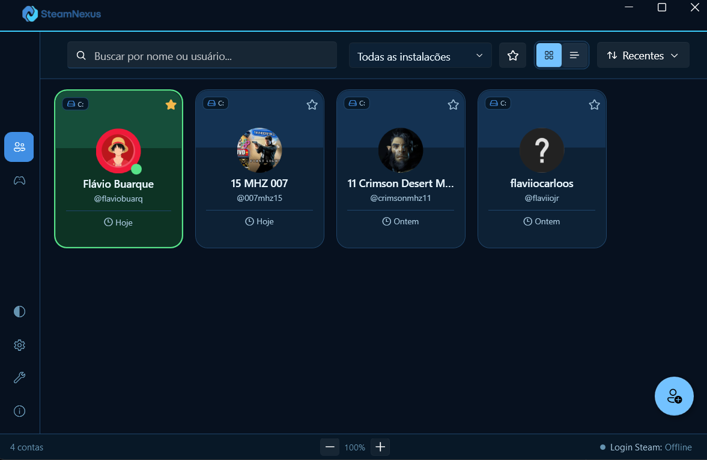
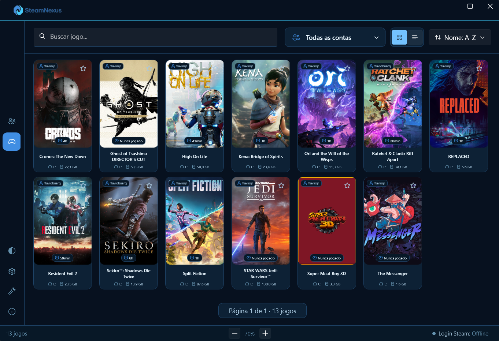

<div align="center">
  

  <p><strong>Gerencie contas e jogos da Steam com rapidez, organização e uma interface moderna.</strong></p>

  <p>
    <a href="https://github.com/flaviobuarque/SteamNexus/releases/latest">
      
    </a>
    <a href="https://github.com/flaviobuarque/SteamNexus/actions/workflows/release.yml">
      
    </a>
    
    
  </p>

  <p>
    <a href="#-recursos">Recursos</a> •
    <a href="#-capturas-de-tela">Capturas</a> •
    <a href="#-instalação">Instalação</a> •
    <a href="#-como-funciona">Como funciona</a> •
    <a href="#-desenvolvimento">Desenvolvimento</a> •
    <a href="#-inspiração-e-créditos">Créditos</a>
  </p>
</div>

---

## ✨ Sobre o SteamNexus

O **SteamNexus** é um aplicativo desktop para Windows criado para quem utiliza várias contas da Steam. Ele reúne troca de contas, biblioteca de jogos, favoritos e personalização em um único lugar, evitando etapas repetitivas no cliente da Steam.

O aplicativo lê as contas reconhecidas pela instalação local da Steam e foi projetado para continuar responsivo mesmo com bibliotecas e listas de contas grandes.

> [!IMPORTANT]
> O SteamNexus é um projeto independente e não possui vínculo, patrocínio ou aprovação da Valve Corporation. Steam e o logotipo Steam são marcas de seus respectivos proprietários.

## 💡 Inspiração e créditos

O SteamNexus teve como uma de suas principais referências o projeto open source
[TcNo Account Switcher](https://github.com/TCNOco/TcNo-Acc-Switcher), criado por
[TCNOco](https://github.com/TCNOco). Sua abordagem para troca de contas e
automação de clientes ajudou a inspirar decisões e estudos realizados durante o
desenvolvimento deste aplicativo.

O SteamNexus é um projeto independente, com identidade, interface, arquitetura e
objetivos próprios. Não é uma versão oficial, derivação endossada ou produto
afiliado ao TcNo Account Switcher ou aos seus responsáveis.

## 🧠 Engenharia e aprendizado

O SteamNexus também é um projeto de engenharia aplicada criado para aprofundar
conhecimentos em **C#**, **.NET** e **WPF** por meio do desenvolvimento de um
produto real. O trabalho envolve arquitetura, integração com o Windows e a
Steam, persistência local, desempenho, experiência do usuário, testes e entrega
contínua.

Ferramentas de inteligência artificial foram utilizadas como apoio ao processo
de desenvolvimento, incluindo pesquisa, análise de alternativas e revisão de
implementações. As decisões técnicas, a integração das mudanças, os testes e a
validação do comportamento do aplicativo permanecem sob responsabilidade do
autor. Essa abordagem combina estudo contínuo com práticas profissionais de
engenharia de software e desenvolvimento orientado a produto.

## 🚀 Recursos

### 👥 Contas

- Troca rápida entre contas já registradas na Steam.
- Identificação clara da conta ativa.
- Ordenação por uso recente ou ordem alfabética.
- Busca por nome de exibição ou nome de usuário.
- Visualização em grade ou lista compacta.
- Contas favoritas exibidas com prioridade.
- Edição local de nome, avatar e status de entrada.
- Ações rápidas pelo menu de contexto.
- Limpeza segura de registros antigos por período de inatividade.

### 🎮 Biblioteca de jogos

- Descoberta de jogos instalados nas bibliotecas locais da Steam.
- Filtro por conta proprietária e busca por nome.
- Ordenação alfabética, por tempo jogado ou tamanho em disco.
- Visualização em grade ou lista compacta.
- Jogos favoritos com acesso prioritário.
- Capas carregadas sob demanda e armazenadas em cache.
- Suporte a capas personalizadas por meio da SteamGridDB.
- Inicialização do jogo usando a conta escolhida.

### 🎨 Experiência e personalização

- Temas claro, escuro e sincronizado com o sistema.
- Atalho global configurável para mostrar ou ocultar a janela.
- Comportamento configurável após trocar de conta ou abrir um jogo.
- Integração com a bandeja do sistema.
- Interface virtualizada e carregamento progressivo para listas extensas.
- Cache local de avatares e capas para navegação mais rápida.

### 🔄 Atualizações

- Verificação de novas versões dentro do aplicativo.
- Opção para ativar ou desativar verificações automáticas.
- Download em segundo plano com indicação de progresso.
- Instalação e reinicialização assistidas pelo Velopack.
- Pacotes diferenciais nas versões seguintes, reduzindo o tamanho das atualizações quando possível.

## 📸 Capturas de tela

<p align="center">
  
  
</p>

## 📥 Instalação

1. Acesse a página de [Releases](https://github.com/flaviobuarque/SteamNexus/releases/latest).
2. Baixe o arquivo `SteamNexus-win-Setup.exe` da versão mais recente.
3. Execute o instalador e abra o SteamNexus.
4. Na primeira execução, siga o assistente para localizar e importar as contas da Steam.

O pacote é autocontido: não é necessário instalar o .NET separadamente.

### Requisitos

- Windows 10 ou Windows 11 de 64 bits.
- Cliente Steam instalado.
- Contas previamente lembradas pela Steam para realizar trocas sem solicitar novamente as credenciais.

> [!NOTE]
> O Windows pode exibir um aviso do SmartScreen enquanto o executável ainda não possuir assinatura digital com reputação estabelecida.

## 🧭 Como funciona

O SteamNexus consulta o arquivo local `config/loginusers.vdf`, mantido pelo próprio cliente Steam, para localizar as contas lembradas e identificar a conta usada mais recentemente.

Ao solicitar uma troca, o aplicativo:

1. fecha o cliente Steam de maneira controlada;
2. atualiza a conta marcada para login automático;
3. mantém uma cópia de segurança do arquivo alterado;
4. inicia novamente a Steam com a conta selecionada.

Senhas e credenciais não são lidas nem armazenadas pelo SteamNexus. Avatares, preferências, favoritos e cache permanecem localmente no computador do usuário.

## 🔐 Privacidade e segurança

- Não armazena senhas da Steam.
- Não envia a lista de contas para um servidor próprio.
- Preferências e personalizações são salvas em `%LocalAppData%\SteamSwitcher`.
- A conta ativa e registros sem uma data confiável são preservados pela limpeza de contas antigas.
- Antes de alterações relevantes no `loginusers.vdf`, o aplicativo cria uma cópia de segurança local.

## 🛠️ Desenvolvimento

### Tecnologias

- [.NET 10](https://dotnet.microsoft.com/)
- WPF
- [WPF UI](https://github.com/lepoco/wpfui)
- CommunityToolkit.Mvvm
- [Velopack](https://velopack.io/)
- xUnit

### Compilar localmente

```powershell
git clone https://github.com/flaviobuarque/SteamNexus.git
cd SteamNexus
dotnet restore SteamSwitcher.sln
dotnet build SteamSwitcher.sln -c Release
```

### Executar os testes

```powershell
dotnet test SteamSwitcher.Tests/SteamSwitcher.Tests.csproj -c Release
```

### Estrutura principal

```text
SteamSwitcher/        Interface WPF, páginas, temas e ViewModels
SteamSwitcher.Core/   Modelos e serviços de domínio
SteamSwitcher.Tests/  Testes automatizados
docs/                 Documentação técnica e imagens
.github/workflows/    Automação de releases
```

## 🤝 Contribuições e problemas

Encontrou um erro ou tem uma sugestão? Abra uma [issue](https://github.com/flaviobuarque/SteamNexus/issues) descrevendo:

- o comportamento observado;
- o comportamento esperado;
- a versão do SteamNexus e do Windows;
- passos para reproduzir;
- capturas de tela ou logs, sem dados pessoais.

Pull requests são bem-vindos. Antes de enviar uma alteração, compile a solução e execute os testes.

## 📄 Licença

O SteamNexus é disponibilizado sob a [licença MIT](LICENSE). Você pode usar,
modificar e distribuir o projeto, desde que preserve o aviso de copyright e os
termos da licença.

## 🗺️ Próximos passos

- Expandir a cobertura de testes automatizados.
- Melhorar continuamente acessibilidade e navegação por teclado.
- Adicionar novas integrações somente quando puderem ser oferecidas com segurança e boa experiência.

---

<div align="center">
  Feito com 💙 para tornar o uso de múltiplas contas Steam mais simples.
</div>
