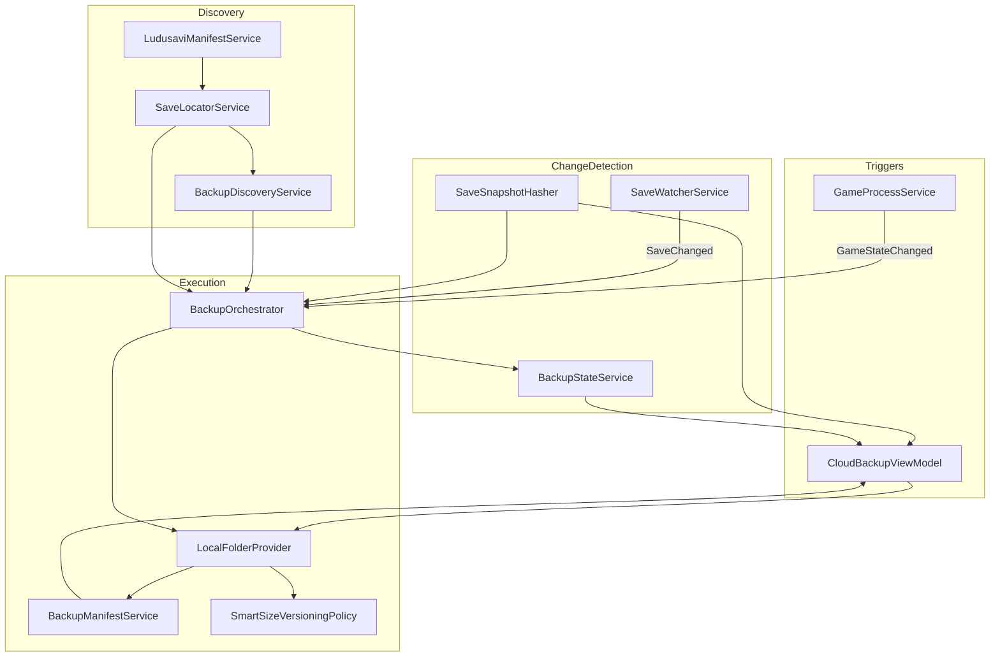
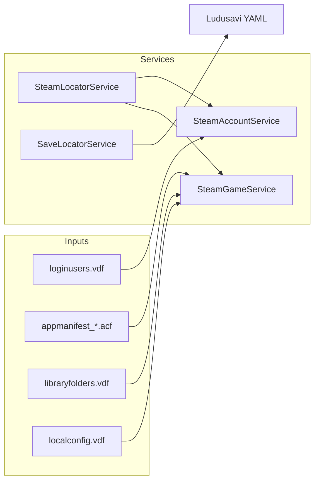

# SteamSwitcher — Arquitetura

## Padrão Arquitetural

O sistema segue **MVVM clássico** com **injeção de dependências** via `Microsoft.Extensions.Hosting`:

- **Views (XAML)** — apresentação pura, code-behind mínimo
- **ViewModels** — estado da UI, commands, orquestração leve
- **Services (Core)** — regras de negócio, I/O, integração Steam/Ludusavi
- **Models** — DTOs e entidades de domínio
- **Helpers** — utilitários transversais (paths, escrita atômica, ZIP)

Não há camada de repositório formal: serviços leem/escrevem arquivos diretamente.

---

## Diagrama de Camadas

```
┌─────────────────────────────────────────────────────────────┐
│                    SteamSwitcher (WPF)                       │
│  App.xaml.cs ──► MainWindow ──► Pages ──► ViewModels        │
│  WPF-UI (Theme, Snackbar, Dialogs, Navigation)             │
└──────────────────────────┬──────────────────────────────────┘
                           │ IServiceProvider / DI
┌──────────────────────────▼──────────────────────────────────┐
│                  SteamSwitcher.Core                          │
│  ┌─────────────┐  ┌─────────────┐  ┌─────────────────────┐  │
│  │ Steam/*     │  │ Backup/*    │  │ System / Onboarding │  │
│  └─────────────┘  └─────────────┘  └─────────────────────┘  │
│  ┌─────────────┐  ┌─────────────┐                           │
│  │ Cache/*     │  │ Helpers/*   │                           │
│  └─────────────┘  └─────────────┘                           │
└──────────────────────────┬──────────────────────────────────┘
                           │
┌──────────────────────────▼──────────────────────────────────┐
│              Sistema de Arquivos / Registry / Processos       │
│  Steam (VDF, ACF), Saves, %LocalAppData%\SteamSwitcher\     │
└─────────────────────────────────────────────────────────────┘
```

---

## Composição de Serviços (DI)

### Infraestrutura

| Interface | Implementação | Responsabilidade |
|-----------|---------------|------------------|
| `ISteamLocatorService` | `SteamLocatorService` | Localizar Steam via registry |
| `IAppSettingsService` | `AppSettingsService` | CRUD `settings.json` |
| `IImageCacheService` | `ImageCacheService` | Cache HTTP de imagens |

### Contas Steam

| Interface | Implementação |
|-----------|---------------|
| `ISteamAccountService` | `SteamAccountService` |
| `IAccountOverrideService` | `AccountOverrideService` |
| `IHealthCheckService` | `HealthCheckService` |

### Jogos

| Interface | Implementação |
|-----------|---------------|
| `ISteamGameService` | `SteamGameService` |
| `IAchievementService` | `AchievementService` |
| `IPlaytimeBaselineService` | `PlaytimeBaselineService` |
| `IGameProcessService` | `GameProcessService` |
| `ILudusaviManifestService` | `LudusaviManifestService` |
| `ISaveLocatorService` | `SaveLocatorService` |

### Backup

| Interface | Implementação |
|-----------|---------------|
| `IBackupStateService` | `BackupStateService` |
| `ISaveWatcherService` | `SaveWatcherService` |
| `IBackupOrchestrator` | `BackupOrchestrator` |
| `IVersioningPolicy` | `SmartSizeVersioningPolicy` |
| `ICloudBackupProvider` | `LocalFolderProvider` |
| `IBackupManifestService` | `BackupManifestService` |
| `IRestoreService` | `RestoreService` |
| `IBackupDiscoveryService` | `BackupDiscoveryService` |

### Sistema

| Interface | Implementação |
|-----------|---------------|
| `ISystemService` | `SystemService` |
| `IWatchdogService` | `WatchdogService` |
| `IModMonitorService` | `ModMonitorService` |
| `IOnboardingService` | `OnboardingService` |

---

## Subsistema de Backup — Arquitetura Detalhada



### Contratos principais

**`IBackupOrchestrator`** — coordena watchers e backup automático ao fechar jogo. Não expõe `CreateBackupAsync` publicamente; lógica duplicada em `CloudBackupViewModel` para backup manual.

**`ICloudBackupProvider`** — abstração preparada para cloud, mas única implementação é pasta local. Métodos: `CreateBackupZipAsync`, `UploadAsync`, `DownloadAsync`, `ListVersionsAsync`.

**`IBackupStateService`** — persiste comparação `LastSaveHash` vs `LastBackupHash` por AppID.

---

## Subsistema Steam — Arquitetura



### Detecção de jogo em execução

`GameProcessService` mantém mapa `appId → installFullPath` e a cada 5 segundos enumera **todos** os processos do sistema, comparando `MainModule.FileName` com prefixo do caminho de instalação.

Eventos `GameStateChanged` são consumidos por:

- `BackupOrchestrator` — backup ao fechar
- `GamesViewModel` — indicador "em execução" na UI

---

## Fluxo de Dados — Backup Completo

```
[Ludusavi YAML]
      ↓ FindBySteamAppIdAsync
[SaveLocatorService.GetSaveLocationsAsync]
      ↓ BackupSourceSet (files + registry existentes)
      ├─► SaveWatcherService.Watch (diretórios pai dos saves)
      ├─► SaveSnapshotHasher.Compute → backup_state.json
      └─► [trigger] LocalFolderProvider.CreateBackupZipAsync
                ↓ temp ZIP em %TEMP%
                ↓ SHA256 do ZIP
                ↓ UploadAsync → backups/{game}/{version}.zip
                ↓ BackupManifestService.AddVersionAsync
                ↓ SmartSizeVersioningPolicy (prune por tamanho)
                ↓ backup_state.json atualizado
```

---

## Padrões de Persistência

### Escrita atômica (`AtomicFile.WriteAllTextAsync`)

1. Escreve em arquivo `.tmp` com GUID
2. `File.Move` para destino final com overwrite

Usado em: `settings.json`, `backup_state.json`, `manifest.json`.

### Escrita não-atômica

- `WatchdogService` — `File.WriteAllText` direto
- `game_owners.json` — escrita direta
- Cópia de ZIP — `File.Copy` sem staging

### Concorrência

| Recurso | Mecanismo |
|---------|-----------|
| `backup_state.json` | `SemaphoreSlim` global |
| `manifest.json` por jogo | `SemaphoreSlim` por AppID |
| Criação de backup | **Nenhum lock** |
| `SaveWatcherService` | `Lock` interno para watchers/debounce |

---

## UI — Arquitetura de Navegação

```
MainWindow (FluentWindow + Tray)
├── AccountsPage      → AccountsViewModel
├── GamesPage         → GamesViewModel
├── CloudBackupPage   → CloudBackupViewModel (transient)
├── ModsPage          → ModsViewModel
└── SettingsPage      → SettingsViewModel

OnboardingWindow (primeira execução)
└── Steps 0-5
```

### Comunicação entre ViewModels

- `MainViewModel` — status bar compartilhada, tray, inicialização global
- `WeakReferenceMessenger` — eventos de cache/capa em `GamesViewModel`
- `App.GetService<T>()` — acesso estático ao DI container

---

## Extensibilidade Planejada (não implementada)

### Cloud Provider

Para adicionar Google Drive / Dropbox:

1. Implementar `ICloudBackupProvider`
2. Registrar no DI (possivelmente como decorator ou strategy)
3. Adicionar OAuth e settings em `AppSettings`

### Restore

O ZIP já contém `sources.json` com paths originais resolvidos. `RestoreService` precisa:

1. Ler `sources.json`
2. Extrair `files/{n}/content/` para `ResolvedPath` original
3. Importar `registry/{n}.json` de volta ao Windows Registry
4. Atualizar `backup_state.json`

---

## Dependências Externas

### NuGet — UI (`SteamSwitcher`)

- WPF-UI 4.*, WPF-UI.Tray, WPF-UI.DependencyInjection
- FluentIcons.Wpf 2.*
- CommunityToolkit.Mvvm 8.*
- Microsoft.Extensions.Hosting 10.*

### NuGet — Core (`SteamSwitcher.Core`)

- ValveKeyValue 0.13.1.398
- YamlDotNet 16.*
- CommunityToolkit.Mvvm 8.*
- Microsoft.Extensions.Hosting / Logging 10.*

### APIs externas (runtime)

- Ludusavi manifest: `raw.githubusercontent.com/mtkennerly/ludusavi-manifest/...`
- Steam CDN: capas de jogos
- Steam Community XML: avatares
- SteamGridDB API (opcional, via API key)

---

## Decisões Arquiteturais Notáveis

| Decisão | Justificativa aparente | Trade-off |
|---------|------------------------|-----------|
| Hash de conteúdo vs timestamp | Detectar mudanças reais | Alto custo de I/O em cada evento |
| FileSystemWatcher + debounce 3s | Evitar backup durante escrita do jogo | Pode perder eventos ou atrasar detecção |
| Backup full sempre | Simplicidade | Sem backup incremental |
| Nome de pasta por `game.Name` sanitizado | Legibilidade humana | Colisão se dois jogos sanitizam igual |
| Regex para editar VDF | Evitar re-serialização ValveKeyValue | Frágil ante mudanças de formato |
| `ICloudBackupProvider` para local | Preparar cloud futura | Nomenclatura confusa na UI |
