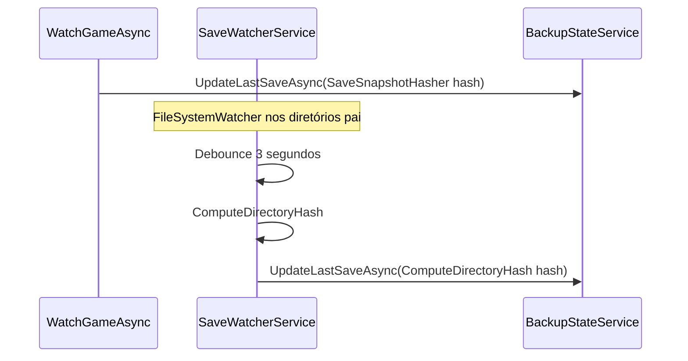
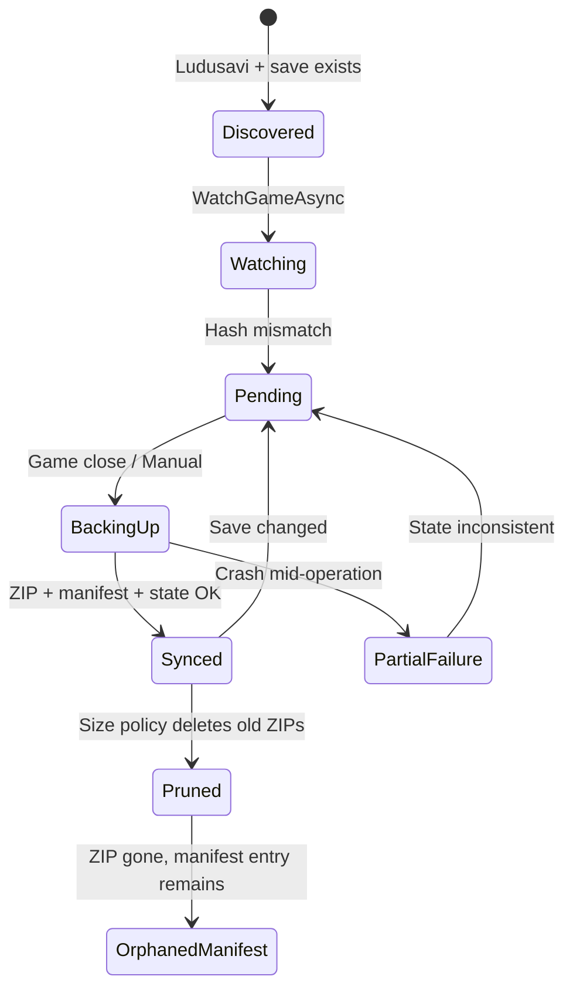

# SteamSwitcher — Análise Profunda do Sistema de Backup

> Esta é a análise mais crítica do sistema. O backup é **funcional para criação e versionamento local**, mas possui falhas estruturais significativas em detecção de mudanças, atomicidade, concorrência e restauração.

---

## 1. Detecção de Alterações nos Saves

### Mecanismo em duas camadas (incompatíveis)

O sistema usa **dois algoritmos de hash distintos** que produzem valores não comparáveis entre si:

#### A) `SaveSnapshotHasher.Compute(BackupSourceSet)` — usado na inicialização e no backup

**Arquivo:** `SteamSwitcher.Core/Services/Backup/SaveSnapshotHasher.cs`

| Aspecto | Comportamento |
|---------|---------------|
| Escopo | Apenas paths definidos no `BackupSourceSet` (Ludusavi) |
| Arquivos | SHA256 do conteúdo, identidade = `ManifestPath` ou `ManifestPath/relative` |
| Ignorados | `.tmp`, `.temp`, `.lock` |
| Registry | Incluído — export JSON via `RegistryBackupHelper` |
| Saída | SHA256 truncado para **16 caracteres hex** |

```csharp
// Formato interno antes do hash final:
// file:{manifestPath}:{sha256hex}
// registry:{key}:{sha256hex}
// → SHA256(join com \n) → primeiros 16 chars
```

#### B) `SaveWatcherService.ComputeDirectoryHash(directories)` — usado pelo FileSystemWatcher

**Arquivo:** `SteamSwitcher.Core/Services/Backup/SaveWatcherService.cs`

| Aspecto | Comportamento |
|---------|---------------|
| Escopo | **Todos os arquivos** nos diretórios observados (recursivo) |
| Arquivos | SHA256 do conteúdo, identidade = **caminho absoluto do arquivo** |
| Ignorados | Nenhum (exceto falhas silenciosas de leitura) |
| Registry | **Não incluído** |
| Saída | SHA256 truncado para **16 caracteres hex** (formato diferente) |

### Fluxo de detecção



### Problema crítico: hashes incompatíveis

- Na inicialização (`WatchGameAsync`), `LastSaveHash` recebe hash do **SaveSnapshotHasher**
- Após qualquer evento do watcher, `LastSaveHash` é **sobrescrito** com hash do **ComputeDirectoryHash**
- `LastBackupHash` é sempre definido pelo **SaveSnapshotHasher** após backup
- Resultado: `HasUnbackedChanges` pode ficar **true permanentemente** após o primeiro evento do watcher, mesmo sem mudanças reais — ou alternar de forma imprevisível

### Snapshot anterior

- **Não existe snapshot de arquivos** persistido
- Apenas hashes em `backup_state.json`:
  - `LastSaveHash`
  - `LastBackupHash`
  - `LastSaveDetectedAt`
  - `LastBackupAt`

### Incremental vs full scan

| Operação | Tipo |
|----------|------|
| Detecção de mudança (watcher) | **Full scan** de todos os arquivos nos diretórios observados a cada evento (pós-debounce) |
| Detecção na inicialização | Full scan via `SaveSnapshotHasher` |
| Backup | Sempre **full** — copia todos os sources para ZIP |

Não há backup diferencial apesar do campo `BackupVersion.Type` suportar `"differential"`.

### O que NÃO é detectado

1. **Mudanças em registry** — watcher só observa diretórios de arquivos
2. **Arquivos fora dos diretórios pai observados** — se Ludusavi aponta arquivo único, observa apenas o diretório pai (pode incluir arquivos irrelevantes no hash do watcher, mas não no hasher)
3. **Mudanças enquanto debounce ativo** — apenas o último evento após 3s dispara recálculo

---

## 2. Processo de Backup

### Ordem de execução — Backup automático (`BackupOrchestrator.CreateBackupAsync`)

| # | Etapa | Detalhe |
|---|-------|---------|
| 1 | Resolver jogo | `GetInstalledGamesAsync` + match por AppID |
| 2 | Resolver saves | `SaveLocatorService.GetSaveLocationsAsync` — **alvo:** sem SteamID32; expansão Ludusavi de `<storeUserId>` |
| 4 | Filtrar sources | Apenas `Exists == true` |
| 5 | Abortar se vazio | `!sources.HasAnySource` → return |
| 6 | Calcular hash | `SaveSnapshotHasher.Compute(sources)` |
| 7 | Gerar versionId | `v{yyyyMMdd_HHmmss}` UTC |
| 8 | Criar ZIP temp | `%TEMP%\ssw_{appId}_{guid}.zip` |
| 9 | Hash do ZIP | SHA256 completo (64 chars) |
| 10 | Upload | `File.Copy` para pasta de backups |
| 11 | Manifest | `AddVersionAsync` com metadados |
| 12 | Estado | `UpdateLastSaveAsync` + `UpdateLastBackupAsync` |
| 13 | Cleanup | `File.Delete(tempZip)` no finally |

### Ordem de execução — Backup manual (`CloudBackupViewModel.BackupNowAsync`)

Lógica **duplicada** do orchestrator com diferenças:

- Verifica `LastBackupHash == currentHash` para skip ("já sincronizado")
- Usa `localProvider` diretamente em vez de `IBackupOrchestrator`
- Não verifica se jogo está em execução
- Feedback via snackbar

### Antes do backup

- Auto: verifica `AutoBackupEnabled`, `BackupOnGameClose`, `HasUnbackedChanges`
- Manual: verifica sources existentes e hash (se já tem versões)
- **Nenhum** dos dois verifica locks de arquivo ou processo do jogo

### Durante o backup

- ZIP criado em thread pool (`Task.Run`)
- Leitura de cada arquivo com `ZipFile.CreateEntryFromFile` / enumeração recursiva
- Registry exportado para JSON dentro do ZIP
- `CancellationToken` respeitado na enumeração

### Depois do backup

- `SmartSizeVersioningPolicy.ApplyAsync` — pode deletar ZIPs antigos
- Estado atualizado com mesmo hash (SaveSnapshotHasher)
- Log Information (auto) ou snackbar (manual)

### Atomicidade

| Etapa | Atômica? |
|-------|----------|
| Criação do ZIP temp | Não — interrupção deixa temp órfão em %TEMP% |
| Copy para destino final | Não — `File.Copy` direto, sem staging |
| Atualização manifest.json | Sim — via `AtomicFile` |
| Atualização backup_state.json | Sim — via `AtomicFile` |
| Conjunto ZIP + manifest + state | **Não transacional** |

### Risco de backup parcial

**Cenário A — Falha durante criação do ZIP:**
- Temp file pode ficar em `%TEMP%` (não limpo se exceção antes do finally)
- Nenhum manifest/state alterado ✓

**Cenário B — ZIP criado, falha no Upload:**
- Temp deletado no finally
- Nenhum backup persistido ✓

**Cenário C — Upload OK, falha no manifest:**
- ZIP existe no disco sem entrada no manifest
- UI não mostra a versão
- Retenção pode apagar o ZIP órfão

**Cenário D — Manifest OK, falha no state:**
- Backup visível na UI
- `HasUnbackedChanges` permanece true → backup redundante no próximo fechamento

**Cenário E — Jogo escrevendo durante backup:**
- Arquivos podem ser lidos em estado inconsistente
- Sem retry, sem verificação de integridade pós-backup dos sources

---

## 3. Integridade dos Dados

### Checksum do arquivo de backup

- SHA256 **completo** (64 hex chars) calculado sobre o ZIP final
- Armazenado em `BackupVersion.Sha256` no manifest
- Validado em `RestoreService.ValidateAsync` / `RestoreAsync` antes de restaurar

### Validação pós-backup

- **Não existe** — o SHA256 é calculado do ZIP recém-criado, mas não há re-leitura/verificação
- Não há validação de que os arquivos dentro do ZIP correspondem aos sources
- `BackupVersion.Files` (lista de arquivos com SHA individual) **nunca é populada**

### Detecção de corrupção

- `RestoreService` compara SHA256 do ZIP com manifest → `MarkCorruptedAsync` se divergir
- Flag `BackupVersion.IsCorrupted` impede restore na UI
- Não há verificação periódica de integridade dos ZIPs existentes

### Registry no backup

- Export: árvore JSON completa de valores e subchaves
- Import: **não implementado**

---

## 4. Concorrência e Segurança

### Jogo / Steam aberto durante backup

| Cenário | Comportamento |
|---------|---------------|
| Backup automático ao fechar jogo | Jogo já detectado como não-running; risco residual de processos filho ou flush pendente |
| Backup manual com jogo aberto | **Permitido** — sem verificação |
| Restore com jogo aberto | **Bloqueado** por `RestoreService.ValidateAsync` |

### Dois backups simultâneos

- **Sem mutex global ou por AppID**
- Cenários possíveis:
  - Auto-backup + manual backup ao mesmo tempo
  - Dois eventos `GameStateChanged` rápidos
  - Backup manual duplo (duplo clique)
- Consequências:
  - Dois ZIPs com versionIds diferentes (mesmo segundo → colisão possível)
  - Race no `backup_state.json` (mitigado por SemaphoreSlim)
  - Race no manifest (mitigado por SemaphoreSlim por appId)
  - Sobrescrita de ZIP se versionId colidir (improvável mas possível)

### Lock de arquivos

- Leitura de saves: sem `FileShare` explícito — usa defaults do .NET
- Jogos com lock exclusivo: `HashFile` retorna `"unreadable"`, `ComputeDirectoryHash` ignora silenciosamente
- Escrita de manifest/state: atômica via temp+move

### Race conditions identificadas

1. **Hash dual** — watcher vs snapshot (ver seção 1)
2. **Backup concorrente** — sem serialização
3. **Versioning policy vs manifest** — deleta ZIPs sem atualizar manifest
4. **UpdateLastSaveAsync separado de UpdateLastBackupAsync** — janela de inconsistência
5. **`async void` handlers** — exceções não observadas no caller

### FileSystemWatcher

- Buffer interno do OS pode overflow → `OnWatcherError` → re-registro (max 3 retries)
- Após 3 falhas, watcher para de funcionar silenciosamente para aquele jogo

---

## 5. Falhas e Recuperação

### Falha no meio do backup

| Ponto de falha | Estado resultante | Recuperação automática |
|----------------|-------------------|------------------------|
| Durante ZIP | Temp órfão | Nenhuma |
| Durante Copy | ZIP parcial ou ausente | Nenhuma |
| Após Copy, antes manifest | ZIP órfão | Nenhuma |
| Após manifest, antes state | Backup visível, status "pendente" | Re-backup redundante |
| Durante versioning prune | Manifest com versão cujo ZIP foi deletado | Restore falha com VersionNotFound |

### Rollback

- **Não existe** rollback transacional
- `RestoreService.CreateSafetyBackupAsync` é **stub vazio** — não cria backup de segurança antes de restore

### Retomada de backup interrompido

- **Não suportada** — cada backup é independente e full

### Logs

| Nível | Uso |
|-------|-----|
| Debug | Erros de watcher, debounce, I/O menor |
| Information | Backup automático criado |
| Warning | Steam não encontrado |
| Error | Falha ao ler loginusers.vdf |

- Provider: apenas `Debug` (Visual Studio Output)
- **Sem arquivo de log persistente**
- Muitos erros críticos logados como Debug e engolidos

---

## 6. Estrutura de Armazenamento

### Hierarquia

```
%LocalAppData%\SteamSwitcher\backups\
└── {SanitizeName(game.Name)}\
    ├── manifest.json
    ├── v20250622_143022.zip
    ├── v20250622_180015.zip
    └── ...
```

### Versionamento

| Aspecto | Implementação |
|---------|---------------|
| ID | `v{yyyyMMdd_HHmmss}` (UTC) |
| Tipo | Sempre `"full"` na prática |
| Retenção | `SmartSizeVersioningPolicy` — limite **100 MB** por jogo, mínimo **2 versões** |
| Pins | Versões com `IsPinned=true` não são deletadas pela policy |
| Labels | Metadado opcional no manifest |
| Corrupted | Flag manual via validação SHA no restore |

### Organização por jogo/conta

**Decisão aprovada:** [DECISION_BACKUP_LUDUSAVI.md](DECISION_BACKUP_LUDUSAVI.md)

- Pastas nomeadas pelo **nome do jogo** (sanitizado), **não** por AppID ou conta
- **Um backup por jogo na máquina** — todas as contas Steam com saves existentes no mesmo ZIP
- `<storeUserId>` resolvido como Ludusavi: expansão `[0-9]+`, não um único SteamID32
- Restore futuro: path-driven via `resolvedPath` em `sources.json`

> ⚠️ **Código atual** ainda usa SteamID32 único (owner → ativa → primeira conta) — ver BUG-012.

### manifest.json — estrutura

```json
{
  "appId": "1245620",
  "gameName": "ELDEN RING",
  "versions": [
    {
      "versionId": "v20250622_143022",
      "timestamp": "2025-06-22T14:30:22Z",
      "sha256": "ABCDEF...",
      "compressedSizeBytes": 15728640,
      "sizeBytes": 0,
      "type": "full",
      "isPinned": false,
      "isCorrupted": false,
      "files": []
    }
  ]
}
```

### backup_state.json — estrutura

```json
{
  "1245620": {
    "lastSaveHash": "A1B2C3D4E5F67890",
    "lastSaveDetectedAt": "2025-06-22T14:25:00Z",
    "lastBackupAt": "2025-06-22T14:30:22Z",
    "lastBackupHash": "A1B2C3D4E5F67890"
  }
}
```

---

## Diagrama Completo do Ciclo de Vida do Backup



---

## Conclusão

O sistema de backup atual é um **MVP de criação e catalogação local** com:

**Pontos fortes:**
- Formato ZIP estruturado com `sources.json` (preparado para restore)
- SHA256 do arquivo de backup
- Escrita atômica de JSONs de metadados
- Versionamento com pins e labels
- Integração Ludusavi para descoberta de paths

**Lacunas críticas:**
- Dois hashes incompatíveis para detecção de mudanças
- Restore não implementado
- Sem atomicidade end-to-end
- Sem proteção contra backup concorrente
- Sem verificação de jogo em execução no backup
- Policy de retenção dessincronizada do manifest
- Performance: full scan + full backup sempre
