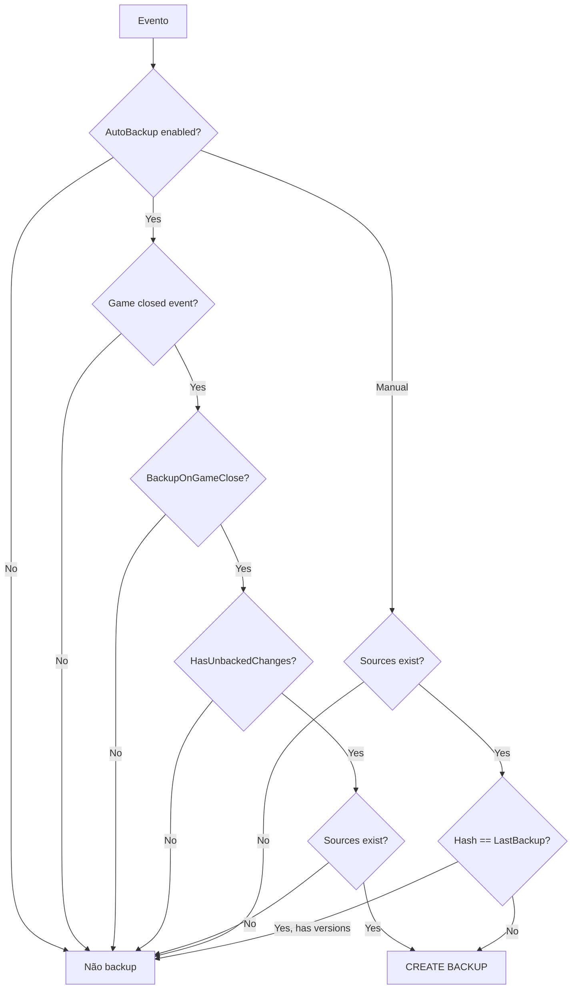

# SteamSwitcher — Regras de Negócio

> Regras extraídas do comportamento real do código, incluindo regras implícitas não documentadas em comentários ou README.

---

## ⚠️ Decisão aprovada — Backup igual ao Ludusavi

**Ver:** [DECISION_BACKUP_LUDUSAVI.md](DECISION_BACKUP_LUDUSAVI.md)

O código **ainda não reflete** esta decisão. As regras **LB-01 a LB-06** abaixo são o **alvo**; as regras R12–R15 na seção 3 descrevem o comportamento **legado** a ser removido.

| ID | Regra alvo |
|----|------------|
| **LB-01** | Backup **não** usa `SteamID32` nem `OwnerAccount` |
| **LB-02** | `<storeUserId>` expande para todas as pastas `[0-9]+` existentes (padrão Ludusavi/Steam) |
| **LB-03** | Incluir apenas paths com `Exists == true` após expansão |
| **LB-04** | Um backup por jogo na máquina, não por conta |
| **LB-05** | Restore futuro: cada arquivo volta ao `resolvedPath` do `sources.json` |
| **LB-06** | Associação jogo→conta existe **somente** para lançar jogo |

---

## 1. O que Constitui um Save Válido

### Definição primária (Ludusavi)

Um jogo tem save válido para o sistema quando **todas** as condições abaixo são verdadeiras:

| # | Regra | Fonte |
|---|-------|-------|
| R1 | AppID do jogo existe no manifest Ludusavi com `steam.id` correspondente | `LudusaviManifestService.FindBySteamAppIdAsync` |
| R2 | Entrada possui pelo menos um `file` ou `registry` com tag `"save"` | `LudusaviGameEntry.HasSaveDefinition` |
| R3 | Constraints `when` são satisfeitas: `os=windows` (ou vazio) E `store=steam` (ou vazio) | `SaveLocatorService.IsApplicable` |
| R4 | Após resolução de placeholders e globs, pelo menos um path **existe** no filesystem OU registry | `SaveLocationResult.HasExistingSave` |

### Definição operacional (UI Backup)

Para aparecer na página Backup (`CloudBackupViewModel`):

```
IsSupported == true
AND HasExistingSave == true  
AND BackupSourceSet.HasAnySource == true (apenas entries Exists)
```

**Regra implícita R5:** Jogos suportados pelo Ludusavi mas **sem arquivos de save criados ainda** são **excluídos** da UI de backup.

### O que NÃO é save válido

- Arquivos de configuração Ludusavi sem tag `save`
- Paths com placeholders não resolvidos (contendo `<` ou `>`)
- Saves de outras stores (GOG, Epic) — filtrados por constraint `store: steam`
- ~~Saves em paths que existem apenas em outra conta~~ → **Alvo (LB-02):** todas as contas com pasta `[0-9]+` existente são incluídas

---

## 2. O que é Incluído no Backup

### Sources incluídos

| Tipo | Critério | Formato no ZIP |
|------|----------|----------------|
| Arquivo | `ResolvedSaveFile.Exists` e `IsFile` | `files/{n}/content/{filename}` |
| Diretório | `Exists` e `IsDirectory` | `files/{n}/content/{relative/path}` recursivo |
| Registry | `ResolvedSaveRegistry.Exists` | `registry/{n}.json` |

### Sources excluídos

| Exclusão | Motivo |
|----------|--------|
| Paths Ludusavi sem tag `save` | Filtro explícito |
| Entries que não existem no disco/registry | `Where(x => x.Exists)` |
| Arquivos `.tmp`, `.temp`, `.lock` | Apenas no **hash** (`SaveSnapshotHasher.ShouldIgnore`), **não** na cópia ZIP |
| Entradas nested cobertas por diretório pai | `SaveLocatorService.Deduplicate` |

### Metadados incluídos

- `sources.json` com formato `SteamSwitcher.BackupSources.v1`
- `files/{n}/source.json` por source individual
- Timestamp UTC em `BackupSourcesMetadata.CreatedAtUtc`

### Regra implícita R6

O backup captura o estado **no momento da execução**, sem garantia de consistência transacional entre múltiplos arquivos.

### Regra implícita R7

Backup é sempre **full** — todos os sources existentes são copiados integralmente a cada versão.

---

## 3. Múltiplas Contas Steam

### Backup (alvo — Ludusavi)

| Regra | Descrição |
|-------|-----------|
| LB-01 | Backup **não** recebe `SteamID32` nem consulta `OwnerAccount` |
| LB-02 | `<storeUserId>` no manifest → expansão filesystem `[0-9]+` (todas as pastas numéricas existentes) |
| LB-03 | Todo path resolvido com `Exists == true` entra no mesmo `BackupSourceSet` |
| LB-04 | Pasta de backup única por jogo: `backups/{NomeJogo}/` — sem subpasta por conta |
| LB-05 | `sources.json` preserva `resolvedPath` absoluto de cada source para restore |

### Lançamento de jogo (inalterado — usa conta)

| Regra | Descrição |
|-------|-----------|
| R8 | `appmanifest_*.acf` pode indicar `LastOwner` — associado automaticamente em `SteamGameService` |
| R9 | Usuário pode associar manualmente via `PickAccountDialog` — persistido em `game_owners.json` |
| R10 | Lançar jogo **sem** owner associado abre dialog; associar **não** lança o jogo |
| R11 | Lançar jogo **com** owner troca para essa conta e abre via `steam://rungameid` |
| LB-06 | Associação jogo→conta aplica-se **apenas** ao fluxo Jogar, não ao backup |

### Legado (código atual — a remover)

> ⚠️ Comportamento presente no código hoje; contradiz LB-01/LB-02.

| Regra | Descrição |
|-------|-----------|
| ~~R12~~ | Backups na mesma pasta `{GameName}` — **mantido** no alvo |
| ~~R13~~ | `storeUserId` → um único `SteamID32` (owner → ativa → primeira conta) — **remover** |
| ~~R14~~ | Troca de conta não re-registra watchers — mitigado no alvo pela expansão filesystem |
| ~~R15~~ | Backup pós-troca com paths da conta errada — **eliminado** no alvo Ludusavi |

---

## 4. Detecção de Mudanças e Estado "Pendente"

### Definição formal

```csharp
HasUnbackedChanges = 
    !string.IsNullOrEmpty(LastSaveHash) 
    && (string.IsNullOrEmpty(LastBackupHash) || LastSaveHash != LastBackupHash)
```

### Regras de atualização de hash

| Evento | Atualiza | Algoritmo |
|--------|----------|-----------|
| `WatchGameAsync` (inicialização) | `LastSaveHash` | `SaveSnapshotHasher` |
| `SaveChanged` (watcher) | `LastSaveHash` | `ComputeDirectoryHash` ⚠️ |
| Backup concluído | `LastSaveHash` + `LastBackupHash` | `SaveSnapshotHasher` |

### Regra implícita R16

"Modificações pendentes" na UI = `HasUnbackedChanges` do `BackupState`.

### Regra implícita R17

Backup manual com versões existentes é **skipped** se `LastBackupHash == SaveSnapshotHasher(sources)` — independente do watcher.

### Gatilhos de backup automático

| Condição | Todas devem ser true |
|----------|---------------------|
| R18 | `AppSettings.AutoBackupEnabled == true` |
| R19 | `AppSettings.BackupOnGameClose == true` |
| R20 | `GameProcessService` detectou transição running → not running |
| R21 | `HasUnbackedChanges == true` |
| R22 | Jogo ainda está instalado |
| R23 | Sources existem após re-resolução Ludusavi |

---

## 5. Versionamento e Retenção

### Criação de versão

| Regra | Valor |
|-------|-------|
| R24 | VersionId = `v{yyyyMMdd_HHmmss}` UTC |
| R25 | Tipo sempre `"full"` na prática |
| R26 | SHA256 do ZIP completo armazenado no manifest |
| R27 | `CompressedSizeBytes` = tamanho do ZIP |

### Retenção (`SmartSizeVersioningPolicy`)

| Regra | Valor |
|-------|-------|
| R28 | Limite total por jogo: **100 MB** (hardcoded, não configurável) |
| R29 | Mínimo de **2 versões** mantidas sempre |
| R30 | Versões `IsPinned == true` nunca deletadas pela policy |
| R31 | Deleção: oldest first por `CreationTimeUtc` |
| R32 | Deleção manual via UI respeita pin — `DeleteVersionAsync` aborta se pinned |

### Regra implícita R33

Policy de retenção opera no filesystem **sem** sincronizar manifest.

---

## 6. Restauração (Regras Definidas vs Implementadas)

### Validação (implementada)

Restore é **bloqueado** quando:

| Condição | `RestoreBlockReason` |
|----------|---------------------|
| Versão não existe no manifest | `VersionNotFound` |
| `IsCorrupted == true` | `VersionCorrupted` |
| Jogo em execução | `GameRunning` |
| ZIP não existe no disco | `VersionNotFound` |
| Espaço em disco < tamanho do backup | `DiskFull` |

### Execução (NÃO implementada)

| Regra planejada | Estado |
|-----------------|--------|
| R34 | Validar SHA256 do ZIP antes de restaurar — ✅ implementado |
| R35 | Criar safety backup antes de restore — ❌ stub |
| R36 | Extrair para paths em `sources.json` — ❌ não implementado |
| R37 | Restaurar registry de `registry/{n}.json` — ❌ não implementado |
| R38 | Atualizar `backup_state.json` pós-restore — ❌ não implementado |

---

## 7. Conflito de Versões

### Não há merge de saves

| Regra | Descrição |
|-------|-----------|
| R39 | Cada backup é snapshot independente — sem merge automático |
| R40 | Usuário escolhe versão específica para restore (quando implementado) |
| R41 | Não há detecção de conflito entre save local e backup — restore sobrescreveria |

### Colisão de versionId

| Regra | Descrição |
|-------|-----------|
| R42 | Dois backups no mesmo segundo UTC → mesmo versionId → overwrite silencioso |

---

## 8. Falha Parcial

### Durante backup

| Regra | Comportamento atual |
|-------|---------------------|
| R43 | Arquivo ilegível no hash → marcado `"unreadable"`, backup continua |
| R44 | Arquivo ilegível no ZIP → exceção pode abortar backup inteiro |
| R45 | Falha após ZIP criado → sem rollback automático |
| R46 | Não existe flag `IsPartial` em `BackupVersion` |

### Durante restore (futuro)

| Regra planejada | Estado |
|-----------------|--------|
| R47 | Safety backup antes de modificar saves | Stub |
| R48 | Rollback se restore falhar no meio | Não definido |

### Regra implícita R49

Erros são preferencialmente logados como `Debug` e não mostrados ao usuário (exceto backup/restore manual via snackbar).

---

## 9. Consistência de Dados

### Garantias existentes

| Garantia | Mecanismo |
|----------|-----------|
| JSON metadata escrito atomicamente | `AtomicFile` |
| SHA256 validado antes de restore | `RestoreService` |
| Manifest por jogo serializado por AppID | `SemaphoreSlim` |

### Garantias ausentes

| Lacuna | Risco |
|--------|-------|
| ZIP + manifest + state não transacional | Estado inconsistente |
| Sem checksum per-file no manifest | Backup silenciosamente incompleto |
| Sem verificação periódica de integridade | Bit rot não detectado |
| Hash dual watcher/snapshot | Estado "pendente" incorreto |

### Regra implícita R50

**Consistência eventual** — o sistema assume que próximo backup corrigirá estado, sem reconciliação automática.

---

## 10. Troca de Conta Steam

| Regra | Descrição |
|-------|-----------|
| R51 | Steam é sempre fechado antes de editar VDF (graceful → kill → 1.2s delay) |
| R52 | Backup de `loginusers.vdf` em `_last` antes de editar |
| R53 | Apenas conta target recebe `MostRecent=1` |
| R54 | `RememberPassword=1` forçado no target |
| R55 | Offline: `WantsOfflineMode=1`, `SkipOfflineModeWarning=1`, `-offline` no launch |
| R56 | Estado: override do dialog > override da conta > `DefaultLoginState` global |
| R57 | Watchdog ativo apenas na troca via AccountsPage UI |
| R58 | Single instance — segunda instância encerra imediatamente |

---

## 11. Descoberta e Monitoramento

| Regra | Descrição |
|-------|-----------|
| R59 | Ludusavi manifest baixado na primeira necessidade se cache ausente |
| R60 | Manifest cacheado indefinidamente em RAM e disco |
| R61 | Watcher registrado por AppID — re-registro substitui anterior |
| R62 | Debounce de 3 segundos em eventos de arquivo |
| R63 | Eventos em `.tmp` e `.zip` ignorados pelo watcher |
| R64 | Jogo "em execução" = processo com `MainModule` path prefix do `InstallFullPath` |
| R65 | Poll de processos a cada 5 segundos (pausável via GamesPage) |

---

## 12. Configurações Padrão

| Setting | Default | Efeito |
|---------|---------|--------|
| `AutoBackupEnabled` | `true` | Habilita sistema de auto-backup |
| `BackupOnGameClose` | `true` | Backup ao detectar fechamento |
| `DefaultLoginState` | `Offline` | Steam inicia offline por padrão |
| `AfterAccountSwitch` | `MinimizeToTray` | Esconde janela após troca |
| `AfterGameLaunch` | `MinimizeToTray` | Esconde janela após lançar jogo |
| `StartSilent` | `true` | Steam com `-silent` |

---

## 13. Regras de UI / Apresentação

| Regra | Descrição |
|-------|-----------|
| R66 | Status backup: pendente = accent, sem backup = warning, sincronizado = success |
| R67 | "Nunca salvo" = pendente E sem versões |
| R68 | "Sincronizado" = tem versões E não pendente |
| R69 | Filtros backup: All, PendingChanges, InstalledWithBackup, InstalledWithoutBackup |
| R70 | `CloudOnly` filter definido mas não aplicado |
| R71 | Página Backup recria ViewModel a cada navegação (re-scan completo) |

---

## Matriz de Decisão — Devo fazer backup?



---

## Glossário

| Termo | Significado no sistema |
|-------|------------------------|
| **Source** | Arquivo, diretório ou chave registry resolvida pelo Ludusavi |
| **Versão** | Um arquivo ZIP + entrada no manifest |
| **Pendente** | `LastSaveHash != LastBackupHash` |
| **Sincronizado** | Hashes iguais e pelo menos uma versão existe |
| **Suportado** | Jogo encontrado no manifest Ludusavi com saves definidos |
| **Provider** | Implementação de `ICloudBackupProvider` (apenas local hoje) |
