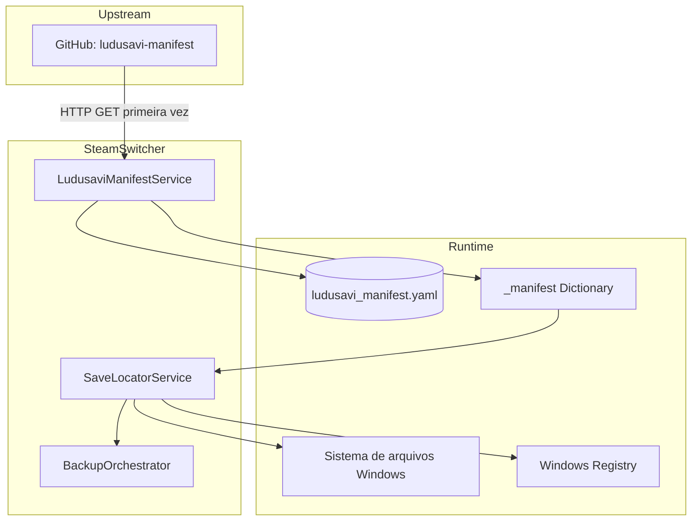
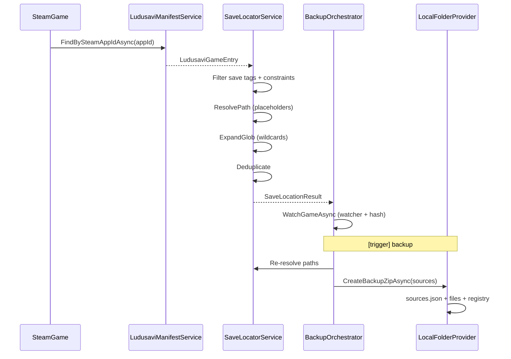

# SteamSwitcher — Análise da Integração Ludusavi

## Visão Geral

O SteamSwitcher **não executa o Ludusavi** nem embarca sua engine de backup. Utiliza exclusivamente o **manifest comunitário** mantido pelo projeto Ludusavi como base de conhecimento para localizar saves de jogos Steam no Windows.

**Fonte upstream:**
```
https://raw.githubusercontent.com/mtkennerly/ludusavi-manifest/master/data/manifest.yaml
```

**Cache local:**
```
%LocalAppData%\SteamSwitcher\ludusavi_manifest.yaml
```

---

## Arquitetura da Integração



### Componentes

| Componente | Arquivo | Responsabilidade |
|------------|---------|------------------|
| `LudusaviManifestService` | `LudusaviManifestService.cs` | Download, cache, parse YAML |
| `ILudusaviManifestService` | `ILudusaviManifestService.cs` | Interface + DTOs |
| `SaveLocatorService` | `SaveLocatorService.cs` | Resolução de paths e globs |
| `BackupSources.cs` | `BackupSources.cs` | DTOs de resultado |

---

## Como a Base Ludusavi é Usada

### 1. Carregamento do manifest

```csharp
// Pseudofluxo de LoadAsync
if (_manifest != null) return _manifest;          // cache RAM
if (!File.Exists(CachePath)) await RefreshAsync(); // download HTTP
yaml = File.ReadAllTextAsync(CachePath);
_manifest = Parse(yaml);
```

**Características:**
- Singleton com cache em memória permanente (`_manifest` field)
- Parse com YamlDotNet, `IgnoreUnmatchedProperties()`
- Naming convention: CamelCase
- Estrutura: `Dictionary<string, LudusaviRawEntry>` onde key = nome do jogo no Ludusavi

### 2. Lookup por Steam AppID

```csharp
manifest.Values.FirstOrDefault(x =>
    string.Equals(x.SteamId, appId, StringComparison.OrdinalIgnoreCase) &&
    x.HasSaveDefinition);
```

**Regras:**
- Compara `steam.id` do YAML (int convertido para string) com AppID Steam
- Exige pelo menos um file/registry com tag `save`
- **FirstOrDefault** — se múltiplas entradas tiverem mesmo Steam ID, retorna a primeira encontrada (ordem não garantida em Dictionary)

### 3. Filtragem de entries

Para cada `file` e `registry` na entrada:

```csharp
.Where(x => x.Value.Tags.Contains("save", StringComparer.OrdinalIgnoreCase))
.Where(x => IsApplicable(x.Value.When))
```

**Constraints suportadas:**

| Constraint | Valor aceito | Outros valores |
|------------|--------------|----------------|
| `os` | vazio ou `windows` | **Rejeitado** |
| `store` | vazio ou `steam` | **Rejeitado** |

**Regra implícita:** constraints com OR entre múltiplas entradas `when` — usa `constraints.Any(...)`, basta uma satisfazer.

**Não suportado:**
- `language`, `wine`, `platform`, outros campos Ludusavi — ignorados via `IgnoreUnmatchedProperties` no parse, mas constraints desconhecidas com valores não-vazios podem falhar `IsApplicable`

---

## Resolução de Caminhos (Placeholders)

### Tabela de substituição

| Placeholder Ludusavi | Resolvido para |
|---------------------|----------------|
| `<base>` | `{LibraryPath}\steamapps\common` |
| `<game>` | `SteamGame.InstallDir` |
| `<storeGameId>` | `SteamGame.AppId` |
| `<storeUserId>` | **Alvo (Ludusavi):** expansão `[0-9]+` no filesystem — **não** substituição por um SteamID32 |
| `<home>` | `%USERPROFILE%` |
| `<winAppData>` | `%APPDATA%` |
| `<winLocalAppData>` | `%LOCALAPPDATA%` |
| `<winLocalAppDataLow>` | `%USERPROFILE%\AppData\LocalLow` |
| `<winDocuments>` | `MyDocuments` |
| `<winPublic>` | `CommonDocuments` |
| `<winProgramData>` | `CommonApplicationData` |
| `<root>` | Caminho de instalação do Steam |

### Pós-processamento

1. `Environment.ExpandEnvironmentVariables`
2. Normalização `/` → `\`
3. Se ainda contém `<` ou `>` → path **inválido**, descartado

### Placeholders NÃO implementados

Comparando com Ludusavi completo, ausentes no SteamSwitcher:

| Placeholder | Impacto |
|-------------|---------|
| `<winDir>` | Paths com Windows dir falham |
| `<storeUserName>` | Não resolvido |
| `<osUserName>` | Não resolvido |
| `<xdgConfig>`, etc. | Irrelevante (só Windows) |
| Variáveis de ambiente customizadas | Não suportadas |

---

## Expansão de Globs

Implementação customizada em `SaveLocatorService.ExpandGlob`:

### Sintaxe suportada

| Padrão | Suporte |
|--------|---------|
| `*` | ✅ Wildcard em componente de path |
| `?` | ✅ Single char wildcard |
| `**` | ✅ Recursivo (globstar) |
| Alternativas `{a,b}` | ❌ Não suportado |
| Character classes `[abc]` | ❌ Não suportado |

### Algoritmo

1. `GetGlobRoot` — encontra prefixo fixo antes do primeiro wildcard
2. `ExpandGlobParts` — recursão por componentes de path
3. `SafeEnumerateDirectories/Files` — try/catch retorna vazio em erro de permissão

### Casos limite

| Caso | Comportamento |
|------|---------------|
| Root não existe | Retorna vazio — entry marcada como não existente |
| Glob sem matches | Nenhum `ResolvedSaveFile` gerado |
| Múltiplos matches | Um `ResolvedSaveFile` por match, `IsGlob = true` |

---

## Deduplicação de Paths

`SaveLocatorService.Deduplicate`:

1. Agrupa por `Path.GetFullPath` case-insensitive
2. Ordena por comprimento de path (menor primeiro)
3. Remove filhos cobertos por diretório pai já na lista
4. Concatena entries que **não existem** (para exibição futura?)

**Exemplo:**
```
<winAppData>/GameA/saves/     (dir, exists)
<winAppData>/GameA/saves/slot1/  (dir, exists) → removido (coberto pelo pai)
```

---

## Registry Saves

### Resolução

```csharp
manifestKey
  .Replace("HKEY_CURRENT_USER", "HKCU")
  .Replace("HKEY_LOCAL_MACHINE", "HKLM")
  .Replace('/', '\\')
```

### Verificação de existência

`RegistryBackupHelper.Exists(key)` — tenta abrir a chave.

### Backup

Export JSON completo: valores + subchaves recursivas.

### Restore

**Não implementado.**

---

## Jogos com Múltiplos Diretórios de Save

### Suporte

O Ludusavi frequentemente define múltiplos paths por jogo:

```yaml
files:
  <winAppData>/Game/Saves: { tags: [save] }
  <winDocuments>/My Games/Game: { tags: [save] }
  <storeUserId>/remote: { tags: [save] }  # Steam Cloud local cache
```

**SteamSwitcher:**
- Processa **todos** os entries com tag `save`
- Cada um vira source independente no `BackupSourceSet`
- Deduplicação remove overlap
- Watcher registra diretório pai de **cada** file existente

### Limitações multi-dir

| Limitação | Detalhe |
|-----------|---------|
| Watcher por diretório pai | Pode observar arquivos não relacionados |
| Hash do watcher | Inclui tudo no diretório, não só o save |
| Steam Cloud local | Incluído se no manifest e existir no disco |
| Saves em registry + files | Files monitorados; registry só no hash snapshot |

---

## Riscos de Incompatibilidade com Updates da Base

### Risco 1 — Cache stale (Severidade: Média)

**Problema:** Manifest nunca atualizado após download inicial.
**Impacto:** Novos jogos não aparecem; correções de path não aplicadas.
**Mitigação atual:** Nenhuma — usuário deve deletar `ludusavi_manifest.yaml`.

### Risco 2 — Schema evolution (Severidade: Baixa)

**Problema:** `IgnoreUnmatchedProperties()` ignora campos novos silenciosamente.
**Impacto:** Novos tipos de constraint ou metadata ignorados.
**Exemplo:** Ludusavi adiciona `when: [{ launcher: steam }]` — não reconhecido, entry pode ser excluída.

### Risco 3 — Placeholders novos (Severidade: Média)

**Problema:** Novos placeholders no upstream não resolvidos.
**Impacto:** Path descartado (contém `<`), save não detectado.

### Risco 4 — Mudança de Steam ID (Severidade: Baixa)

**Problema:** Jogo re-registrado com AppID diferente no manifest.
**Impacto:** Lookup falha até atualizar cache; backups antigos em pasta por nome.

### Risco 5 — Tags diferentes (Severidade: Baixa)

**Problema:** Ludusavi usa tags como `config` para arquivos importantes.
**Impacto:** SteamSwitcher **só** inclui tag `save` — configs não backupeados.

### Risco 6 — Formato YAML edge cases (Severidade: Baixa)

**Problema:** YamlDotNet pode parsear diferente de Ludusavi (Rust).
**Impacto:** Entradas malformadas silenciosamente vazias.

---

## Casos Não Tratados

### Jogos

| Caso | Comportamento |
|------|---------------|
| Jogo não no manifest | `IsSupported = false`, sem backup |
| Jogo no manifest sem saves criados | Excluído da UI backup |
| Jogo desinstalado com backups | Backups permanecem em disco; não aparece na UI |
| Mesmo AppID, múltiplas entradas manifest | Primeira encontrada |
| Jogo GOG/Epic portado com entry Steam | Incluído se `store: steam` ou sem constraint |
| Proton/Wine paths | Não aplicável (só Windows) |

### Paths

| Caso | Comportamento |
|------|---------------|
| Path com permissão negada | Glob retorna vazio; hash ignora |
| Symlinks | Seguidos pelo .NET default |
| Junction points | Seguidos |
| Path muito longo (>260) | Pode falhar silenciosamente |
| OneDrive/cloud synced folders | Tratado como filesystem normal — risco de arquivo em placeholder cloud |

### Contas

| Caso | Comportamento |
|------|---------------|
| `<storeUserId>` com conta errada | **Legado:** paths de outra conta ou vazios — **Alvo:** todas as pastas numéricas existentes |
| Shared library / Family Share | `LastOwner` pode não ser quem jogou — irrelevante para backup no modelo Ludusavi |
| SteamID32 vazio | **Legado:** paths com `<storeUserId>` não resolvidos — **Alvo:** não depende de SteamID32 |

### Registry

| Caso | Comportamento |
|------|---------------|
| Chave 32-bit em WOW64 | Depende do path no manifest |
| Valores binários grandes | Convertidos para hex string no JSON |
| Chave não existente | `Exists = false`, excluída do backup |

---

## Comparação: Ludusavi vs SteamSwitcher

| Capacidade | Ludusavi | SteamSwitcher |
|------------|----------|---------------|
| Manifest source | Mesmo YAML | Mesmo YAML |
| Parse completo | Rust engine | YamlDotNet parcial |
| Placeholders | Completo | Subconjunto Windows |
| Globs | Completo | `*`, `?`, `**` |
| Constraints | Todas | `os`, `store` |
| Tags | save, config, etc. | **save only** |
| Backup | Engine própria | ZIP customizado |
| Restore | Completo | **Não implementado** |
| Redirections | Suportado | **Não** |
| Wine/Proton | Suportado | N/A |
| Manifest update | Configurável | Uma vez |
| Per-game override | Suportado | **Não** |

---

## Formato de Dados no Backup (ligação Ludusavi → ZIP)

O `sources.json` preserva metadados Ludusavi:

```json
{
  "format": "SteamSwitcher.BackupSources.v1",
  "createdAtUtc": "2025-06-22T14:30:22Z",
  "files": [
    {
      "manifestPath": "<winAppData>/Publisher/Game/saves",
      "resolvedPath": "C:\\Users\\...\\AppData\\Roaming\\Publisher\\Game\\saves",
      "isGlob": false
    }
  ],
  "registry": [
    {
      "manifestKey": "HKEY_CURRENT_USER/Software/Publisher/Game",
      "registryKey": "HKCU\\Software\\Publisher\\Game",
      "exists": true
    }
  ]
}
```

**Importância para restore futuro:**
- `manifestPath` permite re-resolver se paths mudarem
- `resolvedPath` permite restore direto para local original
- `isGlob` indica se era expansão de wildcard

---

## Fluxo Completo — Do Manifest ao Backup



---

## Decisão aprovada — paridade com Ludusavi

**Ver:** [DECISION_BACKUP_LUDUSAVI.md](DECISION_BACKUP_LUDUSAVI.md)

O SteamSwitcher deve adotar a resolução Ludusavi para Steam: `<storeUserId>` → padrão **`[0-9]*`** no filesystem, não ID de conta ativa.

## Recomendações conceituais (implementação futura)

1. **Refresh periódico** do manifest (semanal ou ao iniciar app)
2. **Implementar placeholders faltantes** conforme documentação Ludusavi
3. **Suportar tag `config`** opcionalmente (setting do usuário)
4. **Override por jogo** — arquivo local para corrigir paths sem esperar upstream
5. **Validar compatibilidade** com versão do schema do manifest
6. **Usar AppID como chave** de pasta de backup, não só nome do jogo
7. ~~**Re-resolver paths** após troca de conta~~ — desnecessário no modelo Ludusavi (expansão por disco)
8. **Testes** com subset do manifest Ludusavi para regressão de parse

---

## Conclusão

A integração Ludusavi no SteamSwitcher é **funcional para descoberta básica de saves Steam no Windows**, mas é uma **implementação parcial** do que o manifest suporta. Os maiores riscos são:

1. **Cache nunca atualizado** — divergência crescente do upstream
2. **Placeholders incompletos** — jogos com paths exóticos não detectados
3. ~~**Dependência de SteamID32 correto**~~ — **resolvido por decisão LB-01/LB-02** (código ainda pendente)
4. **Sem restore** — o valor do manifest no backup só se realiza com restore implementado usando `sources.json`

O formato `SteamSwitcher.BackupSources.v1` está bem projetado para restore futuro compatível com evolução do manifest Ludusavi.
