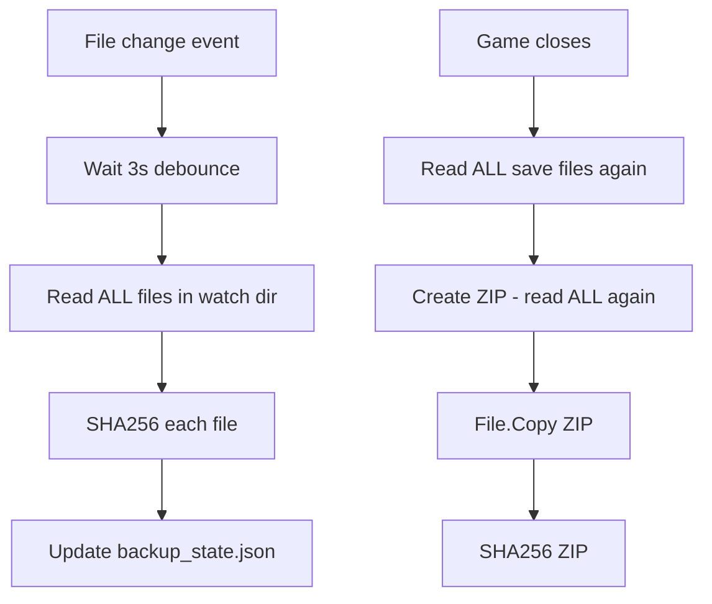

# SteamSwitcher — Relatório de Performance

> Análise do comportamento atual sem propostas de implementação — apenas diagnóstico e recomendações conceituais.

---

## Resumo Executivo

O sistema prioriza **simplicidade** sobre eficiência. Os principais gargalos estão no **subsistema de backup/detecção de mudanças** e no **polling de processos**. Para bibliotecas Steam típicas (50-500 jogos), o impacto é perceptível em CPU e disco durante gameplay e após salvar.

| Área | Classificação | Impacto típico |
|------|---------------|----------------|
| Hash de saves (watcher) | 🔴 Alto | CPU + disco a cada mudança |
| Backup ZIP (full) | 🔴 Alto | Disco + CPU no fechamento do jogo |
| Polling de processos | 🟡 Médio | CPU constante (5s) |
| Scan inicial Ludusavi | 🟡 Médio | Uma vez no startup |
| Enumeração de jogos Steam | 🟢 Baixo | Uma vez + sob demanda |
| UI / imagens | 🟢 Baixo | Cache local eficaz |

---

## 1. Performance do Backup

### Criação do ZIP (`LocalFolderProvider.CreateBackupZipAsync`)

**Comportamento atual:**
- `Task.Run` com `ZipArchiveMode.Create`
- Para cada diretório source: `Directory.EnumerateFiles(..., AllDirectories)` — **full tree walk**
- Cada arquivo: `ZipFile.CreateEntryFromFile` — **lê e comprime integralmente**
- Registry: export JSON completo em memória

**Complexidade:** O(n) onde n = total de bytes + arquivos nos paths de save

**Problemas:**
- Sempre backup **full** — sem deduplicação entre versões
- Re-lê todos os arquivos mesmo se apenas um byte mudou
- Compressão `Optimal` — CPU intensiva para saves grandes
- Sem limite de paralelismo — single-threaded dentro do Task.Run

**Cenários de stress:**
| Jogo | Tamanho save | Tempo estimado* |
|------|--------------|-----------------|
| Indie | < 10 MB | 1-3s |
| RPG médio | 50-200 MB | 5-30s |
| Sandbox / modded | 500 MB+ | 30s-5min+ |

*Estimativas em HDD/SSD consumer; não benchmarked no código.

### Upload local (`UploadAsync`)

- `File.Copy` síncrono em `Task.Run` — segundo read+write completo do ZIP
- **Dobro de I/O** — arquivo lido na criação do ZIP e novamente na cópia

**Otimização conceitual:** criar ZIP diretamente no destino com write atômico, eliminando cópia.

---

## 2. Detecção de Mudanças — Principal Gargalo

### `SaveWatcherService.ComputeDirectoryHash`

Disparado após debounce de 3 segundos por evento de arquivo:

```csharp
foreach (var file in Directory.EnumerateFiles(dir, "*", AllDirectories))
    SHA256.HashData(File.ReadAllBytes(file));  // lê arquivo INTEIRO
```

**Impacto:**
- Save de 100 MB alterado → lê 100 MB+ (todos os arquivos no diretório observado)
- Múltiplos saves rápidos (autosave) → debounce reinicia, mas eventualmente full scan
- Durante gameplay com autosave frequente: **pico de I/O a cada 3s** após último save

### `SaveSnapshotHasher.Compute`

Mesmo padrão na inicialização e pré-backup:

```csharp
var bytes = File.ReadAllBytes(path);
SHA256.HashData(bytes);
```

**Impacto adicional:**
- Chamado em `WatchGameAsync` para cada jogo descoberto no startup
- Chamado novamente imediatamente antes de cada backup
- **Triple read** no pior caso: watcher hash → snapshot hash → ZIP creation

### Comparação com abordagens eficientes

| Abordagem | Este sistema | Ludusavi / rsync-like |
|-----------|--------------|----------------------|
| Detecção | Full content hash | Metadata + selective hash |
| Incremental | Não | Sim |
| Snapshot persistido | Não | Sim |
| Debounce | 3s fixo | Configurável |

---

## 3. Polling de Processos (`GameProcessService`)

**Intervalo:** 5 segundos
**Operação:** `Process.GetProcesses()` — enumera **todos** os processos do sistema

```csharp
foreach (var proc in processes)
    proc.MainModule?.FileName  // pode lançar, wrapped em try/catch
```

**Impacto:**
- Com 200+ processos: alocação e dispose de centenas de objetos `Process` a cada 5s
- `MainModule` acessa memória de cada processo — custoso e pode falhar por permissão
- Pausado quando `GamesPage` não está ativa (`SetPollingActive`), mas **ativo globalmente** quando página visível

**Escala:** Aceitável para uso desktop; problemático em máquinas com muitos processos ou VMs lentas.

**Alternativa conceitual:** WMI filtrado, `WaitForSingleObject` em processos conhecidos, ou hook de `GameStateChanged` via Steam API.

---

## 4. Scan de Inicialização

### `BackupDiscoveryService.ScanInstalledGamesAsync`

Para **cada jogo instalado:**
1. `GetSaveLocationsAsync` → parse Ludusavi + glob expansion
2. `WatchGameAsync` → full hash via SaveSnapshotHasher
3. Leitura de `backup_state.json` e `manifest.json`

**Complexidade:** O(jogos × paths × arquivos)

Com 200 jogos suportados pelo Ludusavi e saves existentes, startup pode levar **dezenas de segundos** lendo todos os saves.

### `CloudBackupViewModel.InitializeAsync`

Repete trabalho similar ao discovery — chamado cada vez que usuário abre página Backup (ViewModel transient).

---

## 5. Uso de Memória

| Operação | Padrão de memória |
|----------|-------------------|
| `File.ReadAllBytes` no hash | Arquivo inteiro em LOH para saves grandes |
| Registry export JSON | Árvore completa em memória |
| ZIP creation | Streaming parcial (entry-by-entry), mas hash prévio carrega tudo |
| HttpClient Ludusavi | Manifest YAML inteiro em memória (~vários MB) |
| `_manifest` cache | Dictionary em memória, nunca liberado |

**Risco:** Saves > 85 KB frequentemente vão para Large Object Heap; GC pressure em sessões longas.

---

## 6. Paralelismo

| Componente | Paralelo? |
|------------|-----------|
| Hash de múltiplos jogos no startup | Não — sequencial |
| Hash de arquivos dentro de um jogo | Não — sequencial |
| Múltiplos backups | Sim — **sem coordenação** (problema de correção, não performance) |
| Watcher debounce tasks | Sim — `Task.Run` por evento |
| Image cache loading | Parcial — `Task.Run` em GamesViewModel |

**Oportunidade:** hashing paralelo por arquivo com `Parallel.ForEach` + `SemaphoreSlim` para limitar I/O.

---

## 7. Cache e Estado

### O que é cacheado

| Dado | Cache | TTL |
|------|-------|-----|
| Ludusavi manifest | `ludusavi_manifest.yaml` + `_manifest` em RAM | Infinito até deletar |
| Imagens (capas, avatares) | `cache/` com hash de URL | 7-30 dias |
| SteamGridDB URLs | `meta/` | 30 dias |
| Mods scan | `mods_cache.json` | Manual refresh |
| Backup state | `backup_state.json` | Persistente |
| Game owners | `game_owners.json` | Persistente |

### O que NÃO é cacheado (reprocessado sempre)

- Hash de conteúdo de saves
- Lista de processos
- Resolução de globs Ludusavi (a cada chamada)
- Enumeração de appmanifest ACF

---

## 8. Estrutura de Snapshot — Lacuna de Performance

Não existe snapshot persistido de metadados de arquivos (tamanho, mtime, hash parcial).

**Consequência:** impossível fazer:
- Comparação incremental O(changed) em vez de O(all)
- Backup diferencial
- Skip de arquivos inalterados no ZIP

**Modelo ideal (conceitual):**

```json
{
  "appId": {
    "files": {
      "manifest/path": { "size": 1234, "mtime": "...", "hash": "abc..." }
    },
    "registry": { "hash": "def..." }
  }
}
```

---

## 9. I/O em Disco — Padrões Problemáticos



**Leituras redundantes no ciclo típico:** 3x mínimo por arquivo alterado.

---

## 10. Impacto na UI Thread

| Operação | Thread |
|----------|--------|
| Backup manual | UI async — `await` em I/O, não bloqueia se bem awaited ✓ |
| `GameProcessService.PollAsync` | Thread pool — OK ✓ |
| `SaveWatcherService` debounce | Thread pool — OK ✓ |
| `AccountsViewModel` VDF watcher | `Dispatcher.InvokeAsync` — pode causar micro-freeze |
| `GamesViewModel.OnGameStateChanged` | `Dispatcher.Invoke` — leve |

**Sem problemas graves de UI blocking** no fluxo de backup — trabalho pesado está em `Task.Run`.

---

## 11. Retenção e Espaço em Disco

`SmartSizeVersioningPolicy`:
- Limite: 100 MB por jogo (hardcoded)
- Mínimo: 2 versões

**Performance side-effect:** prune durante `UploadAsync` — adiciona latência ao final de cada backup.

**Bug de performance/consistência:** deleta ZIPs sem atualizar manifest (ver BUG-005).

---

## 12. Recomendações de Otimização (Conceituais)

### Prioridade alta

1. **Unificar e otimizar hash** — usar metadados (size + mtime) como filtro antes de SHA256
2. **Persistir snapshot de metadados** — evitar full scan repetido
3. **Eliminar cópia dupla do ZIP** — escrever direto no destino
4. **Serializar backups** — evitar I/O concorrente (correção + performance)

### Prioridade média

5. **Paralelizar hash** com limite de concorrência (ex: 4 threads)
6. **Polling de processos** — filtrar por nome em vez de enumerar todos
7. **Cache de SaveLocationResult** por (appId, steamId32) com invalidação
8. **Refresh Ludusavi** em background sem bloquear startup

### Prioridade baixa

9. Compressão `Fastest` para autosave backup (trade-off tamanho/velocidade)
10. Lazy discovery — não hashear todos os jogos no startup, apenas registrar watchers
11. `CloudBackupViewModel` como Singleton para evitar re-scan

---

## 13. Métricas Sugeridas para Benchmark Futuro

Quando implementar otimizações, medir:

| Métrica | Como medir |
|---------|------------|
| Tempo de backup por MB | Stopwatch em CreateBackupZipAsync |
| Tempo de hash por MB | SaveSnapshotHasher vs ComputeDirectoryHash |
| CPU% durante gameplay com watcher | Performance counter 60s |
| Tempo de startup scan | MainViewModel.InitializeAsync |
| Processos enumerados por poll | Counter em GameProcessService |
| LOH allocations | dotnet-gcdump durante backup grande |

---

## Conclusão

O design atual é **O(tamanho_total_dos_saves)** em praticamente every operação crítica. Para jogos com saves pequenos e bibliotecas modestas, é aceitável. Para usuários com muitos jogos, saves grandes ou autosave agressivo, o sistema gerará **I/O e CPU perceptíveis** sem necessidade — principalmente devido à ausência de snapshot incremental e à tripla leitura de arquivos no ciclo mudança→detecção→backup.

A correção do BUG-001 (hash unificado) é pré-requisito para qualquer otimização de cache de hash, pois hoje dois pipelines competem e invalidam qualquer cache conceitual.
