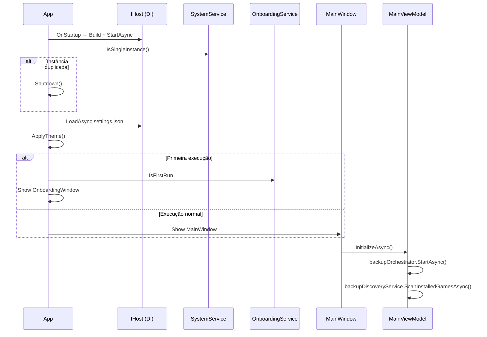
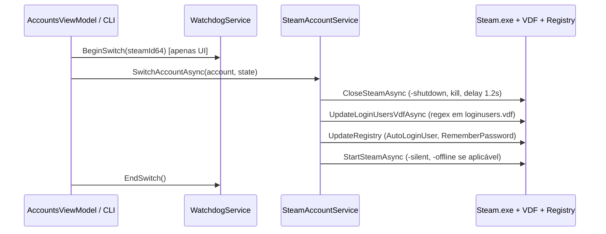
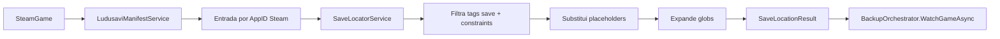
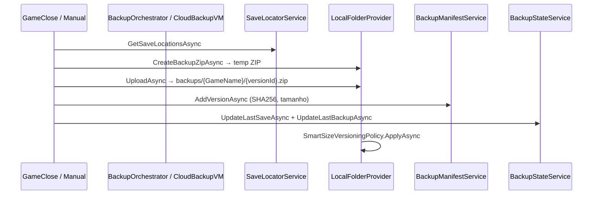
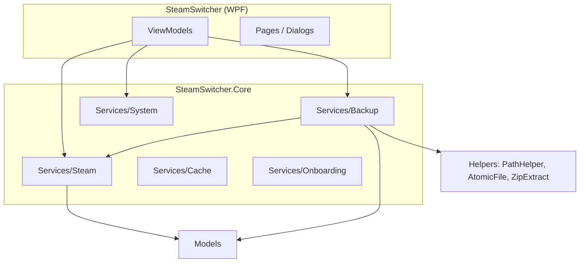

# SteamSwitcher — Visão Geral do Sistema

## Propósito

SteamSwitcher é um aplicativo desktop **.NET 10 / WPF** para Windows que combina:

- **Troca de contas Steam** (inspirado no TcNo Account Switcher)
- **Backup local de saves de jogos** (inspirado no Ludusavi para descoberta de caminhos)
- Monitoramento de processos de jogos, mods do cliente Steam e onboarding de primeira execução

O nome da página "Cloud Backup" é histórico: **não existe sincronização em nuvem implementada**. Apenas armazenamento local em `%LocalAppData%\SteamSwitcher\backups\`.

---

## Stack Tecnológica

| Camada | Tecnologia |
|--------|------------|
| UI | WPF + WPF-UI 4.x + FluentIcons |
| MVVM | CommunityToolkit.Mvvm |
| DI / Hosting | Microsoft.Extensions.Hosting |
| Parsing Steam | ValveKeyValue |
| Manifest Ludusavi | YamlDotNet |
| Persistência | JSON, YAML, ZIP (sem banco de dados) |

---

## Estrutura da Solução

```
SteamSwitcher.sln
├── SteamSwitcher/          → Aplicativo WPF (UI, ViewModels, Views)
├── SteamSwitcher.Core/     → Lógica de domínio e serviços
└── SteamSwitcher.Tests/    → Scaffold xUnit (zero testes implementados)
```

---

## Fluxo de Execução da Aplicação



### Pontos-chave do startup

1. **Single instance** via mutex (`SystemService`)
2. **Settings** carregados de `%LocalAppData%\SteamSwitcher\settings.json`
3. **Watchdog** verifica `watchdog.json` por troca de conta interrompida (crash)
4. **CLI**: `--minimized`, `--switch <steamid64> [--state online|offline|...]`
5. No shutdown: para mod monitor, backup orchestrator, game process service, host

---

## Fluxo de Troca de Conta Steam



### Regras implícitas da troca

- Estado de login: `stateOverride` → override da conta → `AppSettings.DefaultLoginState`
- Fechamento sempre tenta graceful (`-shutdown`) com timeout de 6s, depois kill forçado
- Backup do VDF: `loginusers.vdf_last` antes de editar
- Offline: define `WantsOfflineMode`, `SkipOfflineModeWarning` e lança Steam com `-offline`
- Lançamento de jogo (`SteamGameService.LaunchGameAsync`) **sempre troca conta antes** de `steam://rungameid/{appId}`

---

## Fluxo de Descoberta de Saves (Ludusavi)



A descoberta ocorre em:

- `MainViewModel.InitializeAsync` → `BackupDiscoveryService.ScanInstalledGamesAsync`
- `GamesViewModel.LoadSavePathsAsync` (por jogo, lazy)
- `CloudBackupViewModel.InitializeAsync` (página Backup)

---

## Fluxo de Backup de Saves



### Gatilhos de backup

| Gatilho | Condição | Implementação |
|---------|----------|---------------|
| Fechamento do jogo | `AutoBackupEnabled` + `BackupOnGameClose` + `HasUnbackedChanges` | `BackupOrchestrator.OnGameStateChanged` |
| Manual "Backup agora" | Usuário na página Backup | `CloudBackupViewModel.BackupNowAsync` |
| Restauração | N/A | **Não implementado** |

---

## Estrutura dos Arquivos de Backup

Localização: `%LocalAppData%\SteamSwitcher\backups\{NomeSanitizadoDoJogo}\`

| Arquivo | Conteúdo |
|---------|----------|
| `manifest.json` | Metadados de versões (`BackupManifest`) |
| `v{yyyyMMdd_HHmmss}.zip` | Arquivo de backup compactado |

### Formato interno do ZIP (`SteamSwitcher.BackupSources.v1`)

```
sources.json                    → metadados completos (files + registry)
files/{n}/source.json           → ResolvedSaveFile individual
files/{n}/content/...           → cópia de arquivo ou árvore de diretório
registry/{n}.json               → export JSON da chave de registro
```

---

## Persistência de Dados

**Raiz:** `%LocalAppData%\SteamSwitcher\`

| Arquivo | Serviço | Função |
|---------|---------|--------|
| `settings.json` | AppSettingsService | Preferências do app |
| `backup_state.json` | BackupStateService | Hash último save vs último backup por AppID |
| `backups/{jogo}/manifest.json` | BackupManifestService | Histórico de versões |
| `ludusavi_manifest.yaml` | LudusaviManifestService | Cache do manifest upstream |
| `overrides.json` | AccountOverrideService | Nome/avatar/estado por conta |
| `game_owners.json` | GamesViewModel | Associação manual jogo→conta |
| `watchdog.json` | WatchdogService | Flag de troca em andamento |
| `onboarding.json` | OnboardingService | Estado do wizard |
| `playtime_baseline.json` | PlaytimeBaselineService | Baselines de playtime |

---

## Módulos e Dependências



### Registro DI (`ServiceCollectionExtensions.AddSteamSwitcherCore`)

Todos os serviços core são **Singleton**. `ICloudBackupProvider` está registrado apenas como `LocalFolderProvider`.

---

## Funcionalidades Incompletas ou Stub

| Área | Estado |
|------|--------|
| Restauração de saves | Validação OK; corpo retorna erro fixo |
| Cloud sync (Google Drive, Dropbox) | Interface `ICloudBackupProvider` sem implementação remota |
| `ForgetAccount` / `RestoreAccount` | TODO — só copia VDF |
| Import TcNo no onboarding | Detecta pasta, não importa dados |
| `CloudOnlyGame` / filtro `BackupFilter.CloudOnly` | Modelo/enum existem, não usados |
| Backup diferencial | Campo `Type = "differential"` no modelo, sempre `"full"` |
| Safety backup antes de restore | `CreateSafetyBackupAsync` retorna `Task.CompletedTask` |
| Testes automatizados | Projeto existe, zero arquivos `.cs` de teste |

---

## Navegação da UI

| Página | ViewModel | Ciclo de vida |
|--------|-----------|---------------|
| Contas | AccountsViewModel | Singleton |
| Jogos | GamesViewModel | Singleton |
| Backup | CloudBackupViewModel | **Transient** (recriado a cada visita) |
| Mods | ModsViewModel | Singleton |
| Configurações | SettingsViewModel | Singleton |

---

## Resumo Executivo de Riscos

> **Decisão aprovada:** backup igual ao Ludusavi — ver [DECISION_BACKUP_LUDUSAVI.md](DECISION_BACKUP_LUDUSAVI.md). Item 5 abaixo será eliminado após implementação.

1. **Restauração não funcional** — backups são write-only do ponto de vista do usuário
2. **Dois algoritmos de hash incompatíveis** para detecção de mudanças (ver `BACKUP_DEEP_DIVE.md` e `BUG_REPORT.md`)
3. **Sem lock de backup** — execuções concorrentes possíveis
4. **Retenção de versões** pode apagar ZIPs sem atualizar `manifest.json`
5. ~~**Caminhos de save dependem do SteamID32**~~ — **legado**; alvo: expansão Ludusavi `[0-9]+` sem vínculo a conta
